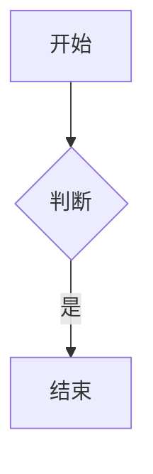

# 一级标题

这是**粗体**、*斜体*、~~删除线~~ 与 `行内代码` 的段落，
还含一个[链接](https://example.com)。

---

## 表格块（光标移出即折叠）

| 列A | 列B | 列C |
|:---|:---:|---:|
| 左对齐 | 居中 | 右对齐 |
| 中文单元格 | 123 | $9.99 |

## 整行图片（折叠为 ）

## 块级数学

$$
\int_{-\infty}^{+\infty} e^{-x^2}\,dx = \sqrt{\pi}
$$

## 行内数学

质能方程 $E = mc^2$ 写在段落里。

## 任务列表

- [x] 已完成事项
- [ ] 未完成事项

## Mermaid 围栏

## 普通列表与引用

- 项目一
- 项目二

> 引用块内容，光标不在本行时 `>` 被隐藏。

结尾段落。
