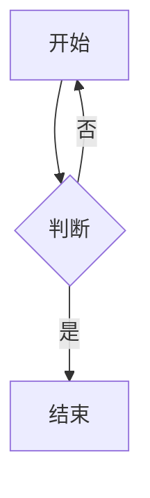

# 一级标题

这是**粗体**、*斜体*、~~删除线~~、==高亮== 与 `行内代码` 的混合段落，
同时包含[外部链接](https://example.com)和双链 [[知识库笔记|别名]]。

## 二级标题：表格与列表

| 列A | 列B | 列C |
|:---|:---:|---:|
| 左对齐 | 居中 | 右对齐 |
| 中文单元格 | 123 | $9.99 |

### 三级标题：任务列表

- [x] 已完成事项
- [ ] 未完成事项
- [x] 另一个已完成

### 嵌套列表

1. 第一项
   - 子项一
   - 子项二
     1. 孙项
2. 第二项

## 引用与分割线

> 这是一段引用文字，支持**嵌套强调**。
> 第二行引用。

---

## 代码块

```js
function greet(name) {
  // 高亮注释
  const msg = `Hello, ${name}!`;
  return msg.toUpperCase();
}
```

```python
def fib(n: int) -> int:
    """Fibonacci."""
    a, b = 0, 1
    for _ in range(n):
        a, b = b, a + b
    return a
```

未知语言代码块（自动检测）：

```
SELECT id, title FROM notes WHERE title LIKE '%测试%';
```

## 数学公式

行内公式 $E = mc^2$ 与块级公式：

$$
\int_{-\infty}^{+\infty} e^{-x^2}\,dx = \sqrt{\pi}
$$

化学式：$\ce{2H2 + O2 -> 2H2O}$

## 脚注

这里有一个脚注[^1]，另一个[^long-note]。

[^1]: 第一个脚注内容。
[^long-note]: 多行脚注，
    可以换行继续。

## Mermaid（说明）



> 注意：`renderMarkdown` 只输出带 `language-mermaid` 的代码块，实际的 SVG 渲染
> 由应用内的 post-process（Preview.vue / cm-live-blocks.ts 的 mermaid.render）完成，
> 纯 Node 环境下保持为代码块原样输出。

## 中文编号行（默认不自动转标题）

6.2 出口许可证管理目录

6.2.1 适用范围

---

### 六、尾部小节

Markdown 转换测试完毕。
